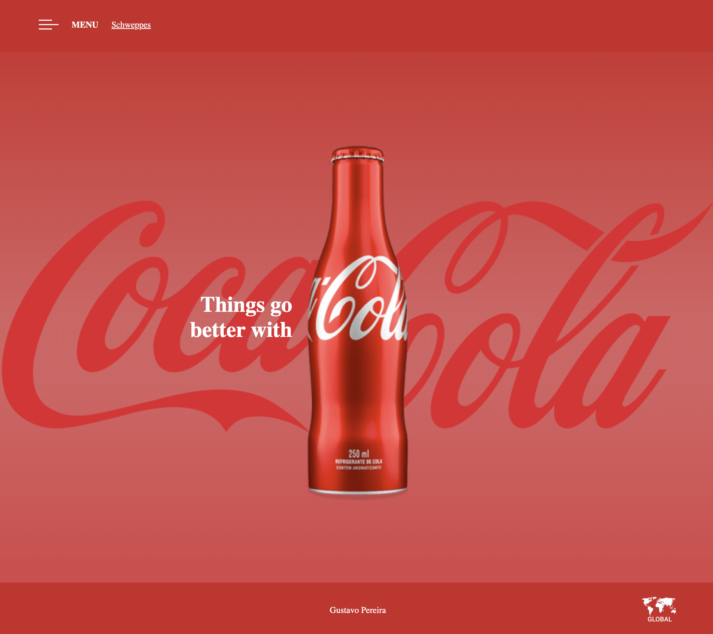

# COCA-COLA

Primeiro website criado, do tipo landing page, para treino no desenvolvimento de sites.
O site foi desenvolvido utilizando boas práticas, como por exemplo tags semânticas e responsividade, nele contêm um link para uma página secundária.

# SCHWEPPES

Segundo website criado, do tipo landing page, para treino no desenvolvimento de sites.
O site foi desenvolvido utilizando boas práticas, como por exemplo tags semânticas e responsividade, nele contêm um link para a página primária.

## Tecnologias
* HTML
* CSS
* Media Queries

## Autor
[Gustavo Pereira](<www.linkedin.com/in/gustavo-pereira-dev-redes>)